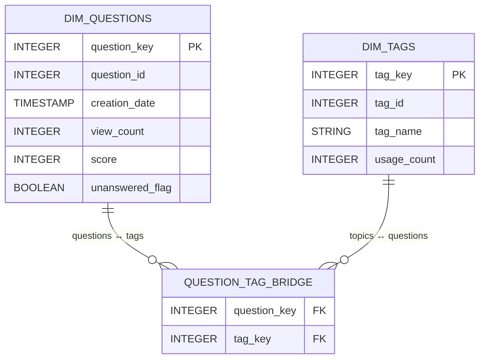

# Project Plan

## Step 1 – ERD of Questions & Tags

We started by documenting the core entities and relationships:

Each dimension preserves its source business key (`question_id`, `tag_id`) while the bridge stores the surrogate keys so every fact can join to the clean taxonomy.

## Step 2 – Set up dbt + dimensions

- **Bronze**: Built `raw_posts_questions` and `raw_tags` sourcing the public BigQuery tables, explicitly selecting columns, and partitioning/clustering by creation date/id for performance.
- **Silver**: Added `stg_questions`, `stg_tags`, and `stg_question_tag_bridge` to standardize columns, split the `<tag>` strings, and normalize tag lookups before the gold layer introduces surrogates.
- **Gold dims**: Created `dim_questions`, `dim_tags`, and `dim_question_tag_bridge` with unique/not-null tests, surrogate keys (via `FARM_FINGERPRINT`), and clustering so downstream facts can join at scale without reprocessing the raw tags each time.

## Step 3 – Make fact table

`fct_tags_stats_monthly` aggregates unanswered questions by `creation_month` and `tag_key`. It counts how many rows joined through the bridge (tagged) versus falling into the `untagged` bucket, calculates averages for `view_count` and `score`, and derives 1/3/6-month deltas to capture momentum in the metrics.

## Step 4 – Build the report

1. Point Looker Studio to `fct_tags_stats_monthly`.
2. Create scorecards for total questions, unanswered questions, and unanswered-with-tags so the first section gives context on volume and coverage.
3. Add a pie chart that shows the share of the tracked tags by `number_of_questions_mentioned_on`, plus a top-20 table that ranks tags by the selected delta metric (1/3/6 month view or score) with conditional formatting to highlight gains/drops.
4. Build a linked time-series chart that filters to the same tags and plots the chosen delta metric month-over-month, using the dropdown control to switch between windows.

This updated plan mirrors what we actually did: from modeling the ERD through building the dbt layers, assembling the fact, and telling the “trending unanswered topics” story in Looker Studio.

