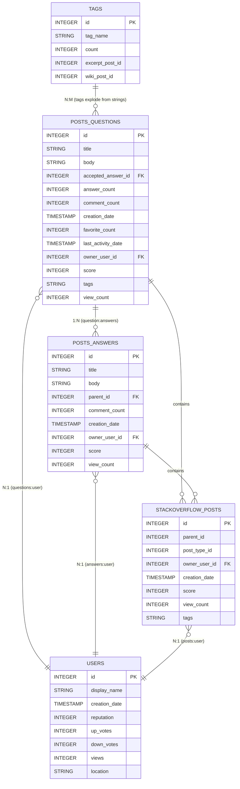
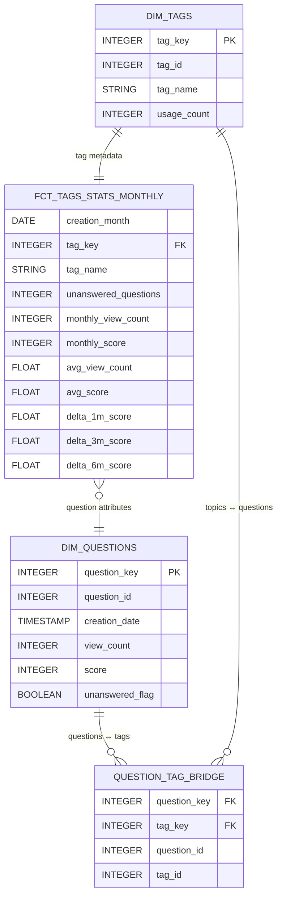

# Data Modeling Methodology

## Overview

This document outlines the dimensional modeling approach taken to analyze Stack Overflow data for identifying popular but unanswered questions. The methodology demonstrates understanding of dimensional modeling concepts including business/surrogate keys, hierarchies, conformed dimensions, and fact table design.

## Source Data Analysis

The Stack Overflow public dataset provides five core tables that represent the complete Q&A ecosystem:

### Full Stack Overflow Schema ERD



## Strategic Scope Decision

### Why Questions + Tags Only?

Given the comprehensive Stack Overflow schema, we strategically focused on **questions** and **tags** to create a streamlined, targeted solution that directly answers the business question while minimizing complexity:

**✅ Included:**
- **Posts Questions**: Core entity containing the unanswered questions we need to analyze
- **Tags**: Taxonomy for categorizing questions by topic

**❌ Excluded:**
- **Posts Answers**: Not needed since we're focusing on unanswered questions
- **Users**: User attribution could be added later but wasn't essential for topic trend analysis
- **Stack Overflow Posts**: Redundant with posts_questions for our scope

This approach provided a large amount of the analytical purpose while trimming down on the complexity of the implementation.

## Dimensional Model Design

### Business vs Surrogate Keys

**Business Keys** preserve the original identifiers from source systems:
- `question_id`: Original Stack Overflow question ID
- `tag_id`: Original Stack Overflow tag ID

**Surrogate Keys** enable dimensional modeling benefits:
- `question_key`: Generated using `FARM_FINGERPRINT(CONCAT('question_', CAST(id AS STRING)))`
- `tag_key`: Generated using `FARM_FINGERPRINT(CONCAT('tag_', CAST(id AS STRING)))`

**Benefits of Surrogate Keys:**
- **Stability**: Independent of source system changes
- **Performance**: Integer keys are faster for joins than string operations
- **Conformed Dimensions**: Same keys work across multiple fact tables
- **SCD Handling**: Easy to implement slowly changing dimensions if needed

### Hierarchies, Dimensions, Attributes, and Levels

**Date/Time Hierarchies:**
- `creation_month`: Month-level aggregation from `creation_date`
- Natural hierarchy: Year → Quarter → Month → Day (implemented via date functions)

**Dimension Tables:**

**dim_questions:**
- **Attributes**: question_id, creation_date, view_count, score, answer_count, comment_count, owner_user_id, tags, unanswered_flag
- **Levels**: Individual questions (grain = 1 row per question)
- **Role**: Descriptive attributes for each question

**dim_tags:**
- **Attributes**: tag_id, tag_name, usage_count, classification
- **Levels**: Individual tags (grain = 1 row per unique tag)
- **Role**: Tag metadata and categorization

### Conformed Dimensions

Both `dim_questions` and `dim_tags` are **conformed dimensions** designed for reuse:
- **Consistent surrogate keys** across all fact tables
- **Standardized attributes** with consistent naming and data types
- **Shared grain** definitions that work for multiple analytical contexts

### Bridge Table Design

The **question_tag_bridge** resolves the many-to-many relationship between questions and tags:

```
dim_question_tag_bridge:
├── question_key (FK to dim_questions)
├── tag_key (FK to dim_tags)
├── question_id (business key)
└── tag_id (business key)
```

**Bridge Table Benefits:**
- **Many-to-many resolution**: Single question can have multiple tags
- **Referential integrity**: Ensures only valid question/tag combinations
- **Performance**: Surrogate key joins are optimized
- **Flexibility**: Easy to add tag-based analytics without changing core dimensions

### Fact Table Design

**fct_tags_stats_monthly** is a **periodic snapshot fact table**:

```
fct_tags_stats_monthly:
├── creation_month (DATE) - Time dimension
├── tag_key (FK) - Tag dimension
├── tag_name (VARCHAR) - Degenerate dimension
├── unanswered_questions (INT) - Count metric
├── number_of_questions_mentioned_on (INT) - Count metric
├── monthly_view_count (INT) - Additive metric
├── monthly_score (INT) - Additive metric
├── avg_view_count (FLOAT) - Derived metric
├── avg_score (FLOAT) - Derived metric
├── delta_1m_score (FLOAT) - Derived metric
├── delta_3m_score (FLOAT) - Derived metric
└── delta_6m_score (FLOAT) - Derived metric
(and corresponding view deltas)
```

**Fact Table Characteristics:**
- **Grain**: One row per tag per month
- **Additive metrics**: monthly_view_count, monthly_score
- **Semi-additive metrics**: unanswered_questions (meaningful across time but not other dimensions)
- **Derived metrics**: Averages and deltas calculated from base metrics
- **Degenerate dimensions**: tag_name included for reporting convenience

## Implemented Model ERD



## Quality Assurance

**Schema Tests:**
- Not null constraints on primary keys and critical fields
- Referential integrity tests between dimensions and bridge
- Uniqueness tests on surrogate keys

**Custom Fact Tests:**
- Data consistency validation (averages match sum/count calculations)
- Range checks for dates and counts
- Business rule enforcement (scores can be negative, view counts must be non-negative)

## Summary

This dimensional model demonstrates:
- **Strategic scoping** to focus on essential entities
- **Proper key design** with business/surrogate key separation
- **Bridge table implementation** for many-to-many relationships
- **Fact table design** optimized for time-series trend analysis
- **Quality assurance** through comprehensive testing

The resulting star schema efficiently supports the analytical question while maintaining flexibility for future enhancements.
